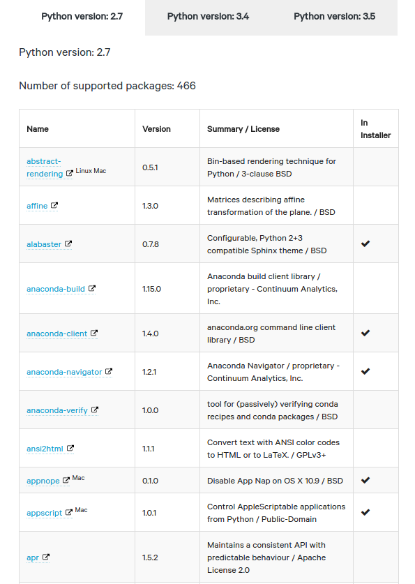
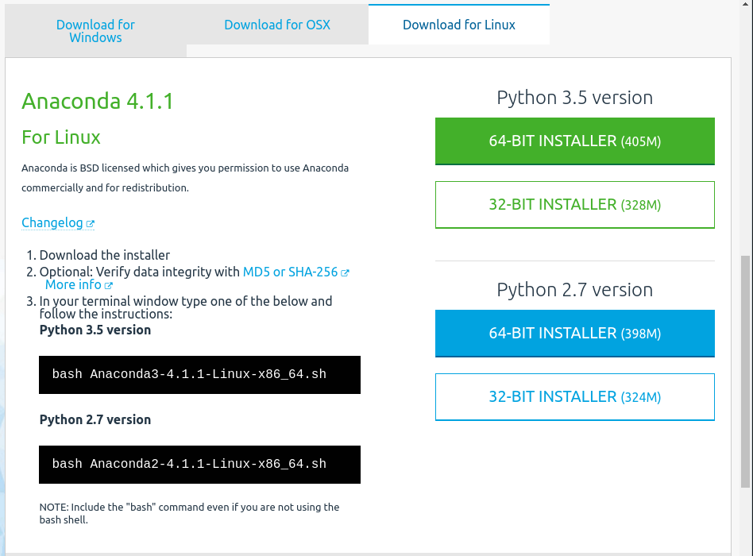
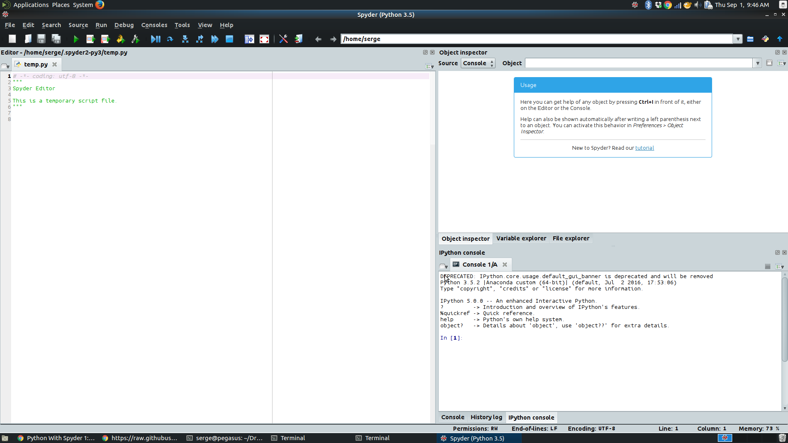

# Python Environments for Geovisualization

## Scientific Python Distributions

### Examples
- Anaconda
- Enthought

### Why and What

- One stop shopping for scientific packages
- Python + (R, Scala, ....)
- Managing Environments

### Anaconda Python Distribution

#### Packages

[Package listing](https://docs.continuum.io/anaconda/pkg-docs)


## Downloading Anaconda https://www.continuum.io/downloads


### Download (Platform specific)




### Modifications of Path
```
~ » tail -3 .bashrc

# added by Anaconda3 4.1.1 installer
export PATH="/home/serge/anaconda3/bin:$PATH"
~ » 

```


## conda

### Uses

- package manager
- creating python environments
- allows you to use different versions of packages
- creation of sand boxes
- install non-python packages

#### Using

```
~ » conda update --help

usage: conda update [-h] [-y] [--dry-run] [-f] [--file FILE] [--no-deps] [-m]
                    [--use-index-cache] [--use-local] [--offline] [--no-pin]
                    [-c CHANNEL] [--override-channels]
                    [-n ENVIRONMENT | -p PATH] [-q] [--copy] [--alt-hint]
                    [--update-dependencies] [--no-update-dependencies]
                    [--channel-priority] [--no-channel-priority]
                    [--show-channel-urls] [--no-show-channel-urls] [--json]
                    [--all]
                    [package_spec [package_spec ...]]

Updates conda packages to the latest compatible version.

This command accepts a list of package names and updates them to the latest
versions that are compatible with all other packages in the environment.

Conda attempts to install the newest versions of the requested packages. To
accomplish this, it may update some packages that are already installed, or
install additional packages. To prevent existing packages from updating,
use the --no-update-deps option. This may force conda to install older
versions of the requested packages, and it does not prevent additional
dependency packages from being installed.

If you wish to skip dependency checking altogether, use the '--force'
option. This may result in an environment with incompatible packages, so
this option must be used with great caution.

Options:

positional arguments:
  package_spec          Packages to update in the conda environment.

optional arguments:
  -h, --help            Show this help message and exit.
  -y, --yes             Do not ask for confirmation.
  --dry-run             Only display what would have been done.
  -f, --force           Force install (even when package already installed),
                        implies --no-deps.
  --file FILE           Read package versions from the given file. Repeated
                        file specifications can be passed (e.g. --file=file1
                        --file=file2).
  --no-deps             Do not install dependencies.
  -m, --mkdir           Create the environment directory if necessary.
  --use-index-cache     Use cache of channel index files.
  --use-local           Use locally built packages.
  --offline             Offline mode, don't connect to the Internet.
  --no-pin              Ignore pinned file.
  -c CHANNEL, --channel CHANNEL
                        Additional channel to search for packages. These are
                        URLs searched in the order they are given (including
                        file:// for local directories). Then, the defaults or
                        channels from .condarc are searched (unless
                        --override-channels is given). You can use 'defaults'
                        to get the default packages for conda, and 'system' to
                        get the system packages, which also takes .condarc
                        into account. You can also use any name and the
```

#### Updating
```
~ » conda --version
conda 4.1.9
~ » conda update conda
Using Anaconda Cloud api site https://api.anaconda.org
Fetching package metadata .......
Solving package specifications: ..........

Package plan for installation in environment /home/serge/anaconda3:

The following packages will be downloaded:

    package                    |            build
    ---------------------------|-----------------
    conda-4.1.11               |           py35_0         204 KB

The following packages will be UPDATED:

    conda: 4.1.9-py35_0 --> 4.1.11-py35_0

Proceed ([y]/n)? y

Fetching packages ...
conda-4.1.11-p 100% |########################################################| Time: 0:00:00 341.60 kB/s
Extracting packages ...
[      COMPLETE      ]|###########################################################################| 100%
Unlinking packages ...
[      COMPLETE      ]|###########################################################################| 100%
Linking packages ...
[      COMPLETE      ]|###########################################################################| 100%
~ » 
```

### Environments

Let's see how conda can help a researcher who is using a popular software package:

```
~ » ipython
Python 3.5.2 |Anaconda custom (64-bit)| (default, Jul  2 2016, 17:53:06) 
Type "copyright", "credits" or "license" for more information.

IPython 5.0.0 -- An enhanced Interactive Python.
?         -> Introduction and overview of IPython's features.
%quickref -> Quick reference.
help      -> Python's own help system.
object?   -> Details about 'object', use 'object??' for extra details.

In [1]: import pysal
---------------------------------------------------------------------------
ImportError                               Traceback (most recent call last)
<ipython-input-1-fd89a27f1db3> in <module>()
----> 1 import pysal

/home/serge/Dropbox/p/pysal/src/pysal/pysal/__init__.py in <module>()
     38     Tool for file input and output, supports many well known file formats
     39 """
---> 40 import pysal.cg
     41 import pysal.core
     42 

/home/serge/Dropbox/p/pysal/src/pysal/pysal/cg/__init__.py in <module>()
      2 A module for computational geometry.
      3 """
----> 4 from shapes import *
      5 from standalone import *
      6 from locators import *

ImportError: No module named 'shapes'

In [2]: 
```

I develop PySAL locally and have set up my `PYTHONPATH` environment variable to point to my git clone of the project so that when I `import pysal` Python finds pysal there:

```
~ » export | grep PYTHONPATH
PYTHONPATH=/home/serge/Dropbox/p/pysal/src/pysal
~ » 
```

The issue is we currently develop PySAL using python 2 and have an installer that will automatically convert to python 3 if that is required.

I'm not installing PySAL in this mode so I run into the clash of my default Python being 3 but the source code in my git clone being in Python 2.

No worries, conda to the rescue.

```
~ » conda env list
# conda environments:
#
pysal2                   /home/serge/anaconda3/envs/pysal2
root                  *  /home/serge/anaconda3

~ » source activate pysal2
(pysal2) ~ » ipython
Python 2.7.12 |Continuum Analytics, Inc.| (default, Jul  2 2016, 17:42:40) 
Type "copyright", "credits" or "license" for more information.

IPython 5.0.0 -- An enhanced Interactive Python.
?         -> Introduction and overview of IPython's features.
%quickref -> Quick reference.
help      -> Python's own help system.
object?   -> Details about 'object', use 'object??' for extra details.

In [1]: import pysal

In [2]: pysal.version
Out[2]: '1.11.3dev'

In [3]: 
```
This works now because I was able to create a *conda environment* that used python 2. The command `source activate pysal2` turned that environment on and then I can continue development and using that development version of PySAL.

Note that this is even though my default install of Anaconda used Python 3. 

```
(pysal2) ~ » python --version
Python 2.7.12 :: Continuum Analytics, Inc.
(pysal2) ~ » 
```

If I turn the environment off and go back to my default we have:

```
(pysal2) ~ » source deactivate
~ » python --version
Python 3.5.2 :: Anaconda custom (64-bit)
~ » 
```

### Creating a new environment
```
~ » conda create --name gis441f16 python=2 matplotlib scipy jupyter ipython
Fetching package metadata .......
Solving package specifications: ..........
Using Anaconda Cloud api site https://api.anaconda.org

Package plan for installation in environment /home/serge/anaconda3/envs/gis441f16:

The following packages will be downloaded:

    package                    |            build
    ---------------------------|-----------------
    pyzmq-15.4.0               |           py27_0         705 KB
    requests-2.11.1            |           py27_0         621 KB
    setuptools-26.1.1          |           py27_0         518 KB
    clyent-1.2.2               |           py27_0          15 KB
    scipy-0.18.0               |      np111py27_0        31.0 MB
    anaconda-client-1.5.1      |           py27_0         110 KB
    jupyter_core-4.1.1         |           py27_0          51 KB
    pickleshare-0.7.3          |           py27_0           8 KB
    tornado-4.4.1              |           py27_0         552 KB
    ipython-5.1.0              |           py27_0         936 KB
    nbformat-4.1.0             |           py27_0         115 KB
    ipykernel-4.4.1            |           py27_0         122 KB
    pango-1.39.0               |                1         668 KB
    notebook-4.2.2             |           py27_0         5.0 MB
    widgetsnbextension-1.2.6   |           py27_0         1.1 MB
    ipywidgets-5.2.2           |           py27_0          58 KB
    nb_anacondacloud-1.2.0     |           py27_0          23 KB
    nb_conda_kernels-2.0.0     |           py27_0          30 KB
    nb_conda-2.0.0             |           py27_0          28 KB
    _nb_ext_conf-0.3.0         |           py27_0          956 B
    nbpresent-3.0.2            |           py27_0         463 KB
    ------------------------------------------------------------
                                           Total:        42.1 MB
```
(Snip)

```
   terminado:          0.6-py27_0        
    tk:                 8.5.18-0          
    tornado:            4.4.1-py27_0      
    traitlets:          4.2.2-py27_0      
    wcwidth:            0.1.7-py27_0      
    wheel:              0.29.0-py27_0     
    widgetsnbextension: 1.2.6-py27_0      
    yaml:               0.1.6-0           
    zeromq:             4.1.4-0           
    zlib:               1.2.8-3           

Proceed ([y]/n)? 
```

```
Proceed ([y]/n)? y

Fetching packages ...
pyzmq-15.4.0-p 100% |########################################################| Time: 0:00:00 757.94 kB/s
requests-2.11. 100% |########################################################| Time: 0:00:00 648.39 kB/s
setuptools-26. 100% |########################################################| Time: 0:00:00 612.64 kB/s
clyent-1.2.2-p 100% |########################################################| Time: 0:00:00 216.99 kB/s
scipy-0.18.0-n 100% |########################################################| Time: 0:00:04   7.24 MB/s
anaconda-clien 100% |########################################################| Time: 0:00:00 334.20 kB/s
jupyter_core-4 100% |########################################################| Time: 0:00:00 253.41 kB/s
pickleshare-0. 100% |########################################################| Time: 0:00:00   2.36 MB/s
tornado-4.4.1- 100% |########################################################| Time: 0:00:00 650.39 kB/s
ipython-5.1.0- 100% |########################################################| Time: 0:00:01 800.04 kB/s
nbformat-4.1.0 100% |########################################################| Time: 0:00:00 351.71 kB/s
ipykernel-4.4. 100% |########################################################| Time: 0:00:00 311.99 kB/s
pango-1.39.0-1 100% |########################################################| Time: 0:00:00 734.86 kB/s
notebook-4.2.2 100% |########################################################| Time: 0:00:01   2.80 MB/s
widgetsnbexten 100% |########################################################| Time: 0:00:01 978.84 kB/s
ipywidgets-5.2 100% |########################################################| Time: 0:00:00 291.23 kB/s
nb_anacondaclo 100% |########################################################| Time: 0:00:00 332.10 kB/s
nb_conda_kerne 100% |########################################################| Time: 0:00:00 440.61 kB/s
nb_conda-2.0.0 100% |########################################################| Time: 0:00:00 213.49 kB/s
_nb_ext_conf-0 100% |########################################################| Time: 0:00:00 284.86 kB/s
nbpresent-3.0. 100% |########################################################| Time: 0:00:00 612.95 kB/s
Extracting packages ...
[      COMPLETE      ]|###########################################################################| 100%
Linking packages ...
[      COMPLETE      ]|###########################################################################| 100%
#
# To activate this environment, use:
# $ source activate gis441f16
#
# To deactivate this environment, use:
# $ source deactivate
#
~ » 
```

### Sourcing and activating

```
~ » source activate gis441f16
(gis441f16) ~ » python
Python 2.7.12 |Continuum Analytics, Inc.| (default, Jul  2 2016, 17:42:40) 
[GCC 4.4.7 20120313 (Red Hat 4.4.7-1)] on linux2
Type "help", "copyright", "credits" or "license" for more information.
Anaconda is brought to you by Continuum Analytics.
Please check out: http://continuum.io/thanks and https://anaconda.org
>>> import pysal
>>> 
(gis441f16) ~ » source deactivate
~ » 
```

Note that on Windows the relevant commands would be `activate name` and `deactivate`


### Python 2 and 3 mixing

In my case I installed Anaconda with Python 3. As we've seen conda allows me to create python 2 environments that I can turn on to work on projects that require python 2. 

You can also go the other way. That is, if you had installed the Python 2 version of Anaconda, you can use conda to create a Python 3 environment if you need to work on code requiring Python 3.

Using conda to create and manage environments gives you great flexibility to mix and match code as well as versions of packages on a project by project basis. Each of the environments can be viewed as a sandbox that is isolated from your default installation.


### Removing envs

If you want to remove an environment after the project is completed and you no longer need the env, you do so as follows.

First let's see what envs we have installed:

```
~ » conda env list
# conda environments:
#
gis441f16                /home/serge/anaconda3/envs/gis441f16
pysal2                   /home/serge/anaconda3/envs/pysal2
root                  *  /home/serge/anaconda3
```

This tells us the `root` env is the default/active one.

We want to delete the `gis441f16` env that we created above:

```
~ » conda remove --name gis441f16 --all
```
(snip)

```
    yaml:               0.1.6-0           
    zeromq:             4.1.4-0           
    zlib:               1.2.8-3           

Proceed ([y]/n)? y

Unlinking packages ...
[      COMPLETE      ]|###########################################################################| 100%
```

try to use the removed evn

```
~ » source activate gis441f16
could not find environment: gis441f16
~ » conda env list
# conda environments:
#
pysal2                   /home/serge/anaconda3/envs/pysal2
root                  *  /home/serge/anaconda3

~ » 

```


## Other tools

Along with conda, Anaconda installs serveral tools that you may find useful. One in particular is the Spyder IDE.

### Spyder

[Tutorial](https://www.youtube.com/watch?v=J5GevIHNctM)

#### Starting Spyder (Linux)


#### Spyder Desktop



